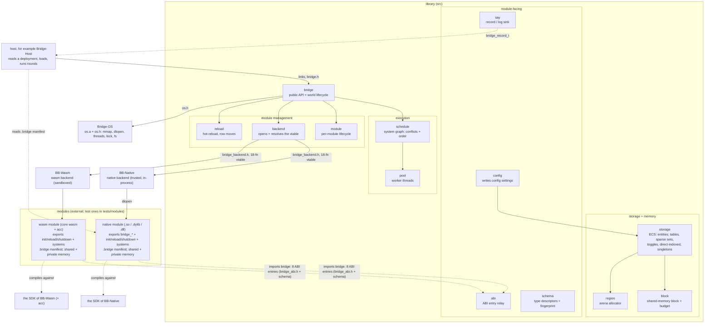

```mermaid
flowchart TB
  host["host, for example Bridge-Host<br/>reads a deployment, loads, runs rounds"]

  host -->|"links, bridge.h"| bridge

  subgraph libg["library (src)"]
    bridge["bridge<br/>public API + world lifecycle"]
    subgraph dmem["storage + memory"]
      storage["storage<br/>ECS: entities; tables, sparse sets,<br/>toggles, direct-indexed, singletons"]
      block["block<br/>shared-memory block + budget"]
      region["region<br/>arena allocator"]
    end
    subgraph exe["execution"]
      schedule["schedule<br/>system graph: conflicts + order"]
      pool["pool<br/>worker threads"]
    end
    subgraph mgmt["module management"]
      module["module<br/>per-module lifecycle"]
      backend["backend<br/>opens + resolves the vtable"]
      reload["reload<br/>hot-reload, row moves"]
    end
    subgraph face["module-facing"]
      abi["abi<br/>ABI entry relay"]
      schema["schema<br/>type descriptors + fingerprint"]
      config["config<br/>writes config settings"]
      say["say<br/>record / log sink"]
    end
    bridge --> schedule
    bridge --> module
    bridge --> backend
    bridge --> reload
    schedule --> pool
    storage --> block
    storage --> region
    config --> storage
  end

  osg["Bridge-OS<br/>os.a + os.h: mmap, dlopen, threads, lock, fs"]
  bridge -->|"os.h"| osg

  backend -->|"bridge_backend.h, 18-fn vtable"| nbk
  backend -->|"bridge_backend.h, 18-fn vtable"| wbk

  nbk["BB-Native<br/>native backend (trusted, in-process)"]
  wbk["BB-Wasm<br/>wasm backend (sandboxed)"]

  nbk -->|"dlopen"| nmod
  wbk --> wmod

  subgraph modg["modules (external; test ones in tests/modules)"]
    nmod["native module (.so / .dylib / .dll)<br/>exports bridge_* + init/reload/shutdown + systems<br/>.bridge manifest; shared + private memory"]
    wmod["wasm module (core wasm + acc)<br/>exports init/reload/shutdown + systems<br/>.bridge manifest; shared + private memory"]
  end

  host -.->|"reads .bridge manifest"| nmod
  nmod -.->|"imports bridge: 8 ABI entries (bridge_abi.h + schema)"| abi
  wmod -.->|"imports bridge: 8 ABI entries (bridge_abi.h + schema)"| abi
  nmod -.->|"compiles against"| nsdk["the SDK of BB-Native"]
  wmod -.->|"compiles against"| wsdk["the SDK of BB-Wasm (+ acc)"]
  say -.->|"bridge_record_t"| host
```
