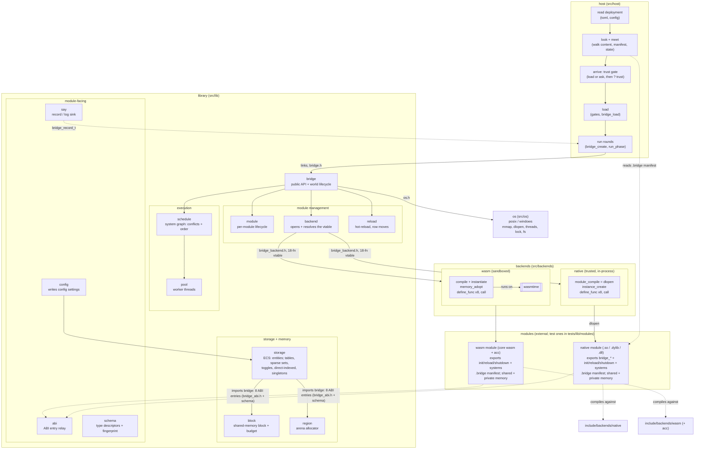

```mermaid
flowchart TB
  subgraph hostg["host (src/host)"]
    direction TB
    hread["read deployment<br/>(toml, config)"]
    hmeet["look + meet<br/>(walk content, manifest, state)"]
    harrive["arrive: trust gate<br/>(load or ask, then ? trust)"]
    hload["load<br/>(gates, bridge_load)"]
    hrun["run rounds<br/>(bridge_create, run_phase)"]
    hread --> hmeet --> harrive --> hload --> hrun
  end

  hrun -->|"links, bridge.h"| bridge

  subgraph libg["library (src/lib)"]
    bridge["bridge<br/>public API + world lifecycle"]
    subgraph dmem["storage + memory"]
      storage["storage<br/>ECS: entities; tables, sparse sets,<br/>toggles, direct-indexed, singletons"]
      block["block<br/>shared-memory block + budget"]
      region["region<br/>arena allocator"]
    end
    subgraph exe["execution"]
      schedule["schedule<br/>system graph: conflicts + order"]
      pool["pool<br/>worker threads"]
    end
    subgraph mgmt["module management"]
      module["module<br/>per-module lifecycle"]
      backend["backend<br/>opens + resolves the vtable"]
      reload["reload<br/>hot-reload, row moves"]
    end
    subgraph face["module-facing"]
      abi["abi<br/>ABI entry relay"]
      schema["schema<br/>type descriptors + fingerprint"]
      config["config<br/>writes config settings"]
      say["say<br/>record / log sink"]
    end
    bridge --> schedule
    bridge --> module
    bridge --> backend
    bridge --> reload
    schedule --> pool
    storage --> block
    storage --> region
    config --> storage
  end

  osg["os (src/os)<br/>posix / windows<br/>mmap, dlopen, threads, lock, fs"]
  bridge -->|"os.h"| osg

  backend -->|"bridge_backend.h, 18-fn vtable"| nbk
  backend -->|"bridge_backend.h, 18-fn vtable"| wbk

  subgraph bkg["backends (src/backends)"]
    subgraph nbk["native (trusted, in-process)"]
      nlife["module_compile = dlopen<br/>instance_create<br/>define_func x8, call"]
    end
    subgraph wbk["wasm (sandboxed)"]
      wlife["compile + instantiate<br/>memory_adopt<br/>define_func x8, call"]
      wasmtime[["wasmtime"]]
      wlife -->|"runs on"| wasmtime
    end
  end

  nbk -->|"dlopen"| nmod
  wbk --> wmod

  subgraph modg["modules (external; test ones in tests/lib/modules)"]
    nmod["native module (.so / .dylib / .dll)<br/>exports bridge_* + init/reload/shutdown + systems<br/>.bridge manifest; shared + private memory"]
    wmod["wasm module (core wasm + acc)<br/>exports init/reload/shutdown + systems<br/>.bridge manifest; shared + private memory"]
  end

  hmeet -.->|"reads .bridge manifest"| nmod
  nmod -.->|"imports bridge: 8 ABI entries (bridge_abi.h + schema)"| abi
  wmod -.->|"imports bridge: 8 ABI entries (bridge_abi.h + schema)"| abi
  nmod -.->|"compiles against"| nsdk["include/backends/native"]
  wmod -.->|"compiles against"| wsdk["include/backends/wasm (+ acc)"]
  say -.->|"bridge_record_t"| hrun
```
